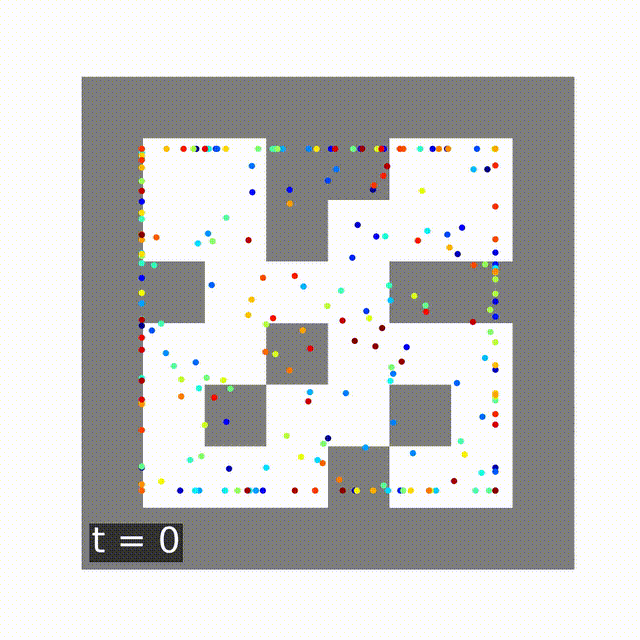

# DiffuserV2

DiffuserV2 extends the ICML 2022 Diffuser framework by reframing trajectory planning as a velocity-parameterized diffusion process and layering on two control enhancements: Model Predictive Path Integral (MPPI) sampling to steer trajectories toward high-return regions, and horizon segmentation with periodic replanning to correct drift. Together, these innovations yield smoother, more stable plans, halve the required diffusion steps, and deliver up to a 21% performance boost over the original Diffuser on sparse-reward Maze2D benchmarks—setting a new state-of-the-art in long-horizon navigation.

<p align="center">
  
  
  
</p>

## Contributions
- **Velocity-based diffusion**: predict latent “velocity” instead of raw noise for temporally coherent trajectory inpainting  
- **MPPI**: softmax-weighted sampling over candidate trajectories to optimize returns  
- **Segmented replanning**: divide the horizon into segments for on-the-fly course corrections and drift recovery  

## Installation
```bash
git clone https://github.com/KevinMathewT/DiffuserV2.git
cd DiffuserV2
pip install -r requirements.txt
```

## Usage

### Training
```bash
python -m scripts.train --config config.maze2d --dataset maze2d-large-v1
python -m scripts.train --config config.maze2d --dataset maze2d-medium-v1
python -m scripts.train --config config.maze2d --dataset maze2d-umaze-v1
```

### Planning with MPPI + Replanning
```bash
python -m scripts.mpc_eval_maze2d plan   --dataset maze2d-umaze-v1   --diffusion_loadpath checkpoints/maze2d-umaze-v1   --diffusion_epoch 100   --num_rollouts 32   --num_samples 16   --num_segments 4   --temperature 4   --conditional
```

## Parameters
- **num_rollouts** (int): number of episodes to execute and average over.  
- **num_samples** (int): number of candidate trajectories sampled at each replanning step.  
- **num_segments** (int): how many equal-length segments to split the planning horizon into for periodic replanning.  
- **temperature** (float): softmax temperature for MPPI weighting; higher values yield flatter weights, lower focus on top trajectories.

## Visualizations
Compare our model vs. original pretrained model - In each case, the diffusion timesteps has been reduced by half:

| H & T                      | Our Model                                                    | Original Model                                             |
|---------------------------|---------------------------------------------------------------|------------------------------------------------------------|
| H=128, T=32               |  |  |
| H=384, n=128, T=128       | |  |
| H=256, n=128, T=128       | |  |

## Results

VelocityDiffuser Results (half diffusion steps)

| Env     | MPPI  | CQL   | IQL   | Diffuser Orig | v=0.0  | v=0.5  | + MPPI+Replan |
|---------|-------|-------|-------|---------------|--------|--------|---------------|
| U-Maze  | 0.332 | 0.057 | 0.474 | 1.139         | 1.341  | 1.355  | **1.379**     |
| Medium  | 0.102 | 0.050 | 0.349 | 1.215         | 1.232  | 1.322  | **1.391**     |
| Large   | 0.051 | 0.125 | 0.586 | 1.230         | **1.244**| 1.094| —             |
| Single-task Avg | 0.162 | 0.077 | 0.470 | 1.195 | **1.272** | 1.257 | —     |